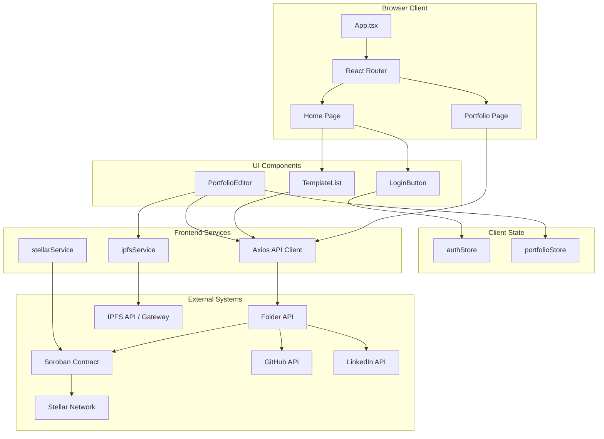
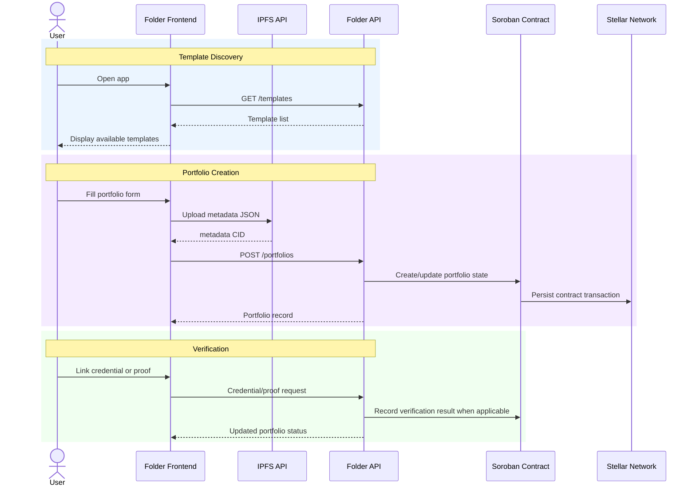

# Folder Frontend 🏗️

[](https://stellar.org)
[](https://react.dev)
[](https://vitejs.dev)
[](https://www.typescriptlang.org)

React/Vite frontend for Folder — a Stellar-based portfolio identity app for creating, verifying, and monetizing professional portfolios backed by IPFS metadata and Soroban contract integrations.

## Overview

Folder Frontend is the browser client for the Folder platform. It provides the user interface for wallet/auth state, portfolio template discovery, portfolio creation, portfolio lookup, IPFS metadata upload, and API calls that coordinate with Folder backend services and the deployed Stellar/Soroban contract.

### The Problem

Professional portfolios are usually static, easy to duplicate, and disconnected from verifiable proof of work. Recruiters, clients, and collaborators often need to trust screenshots, links, or manually curated claims without a portable verification layer.

Folder addresses this by treating a portfolio as a portable on-chain identity surface:

- **Portfolio ownership is tied to a Stellar address** instead of a platform account alone
- **Portfolio metadata is content-addressed through IPFS** so updates can be referenced by immutable CIDs
- **Credential and proof-of-work flows are exposed through API endpoints** for GitHub, LinkedIn, and on-chain activity
- **Templates provide a marketplace-oriented creation flow** for portfolio layouts and schemas

### What Folder Frontend Does

At a high level, this repo does four things:

- **🏠 Presents the Folder landing experience** — unauthenticated users see the product hero and authenticated users see available templates
- **🧩 Lists portfolio templates** — fetches templates from the configured API and displays name, description, and XLM price
- **📝 Creates portfolio metadata** — uploads portfolio JSON to IPFS and sends the resulting CID to the portfolio API
- **🔎 Displays portfolio status** — loads portfolio records by route parameter and shows creation and verification state

> 🔒 **Security Model**: this repository is a frontend client. It should not store private keys, service secrets, API admin keys, or privileged contract credentials. Browser-exposed settings must use `VITE_` variables and should be treated as public.

## Features

- **React 18 + Vite**: fast local development and production build pipeline
- **TypeScript**: typed portfolio, template, credential, proof-of-work, and user models
- **React Router**: routes for `/`, `/dashboard`, `/templates`, `/portfolios/new`, and `/portfolio/:id`
- **Zustand State**: lightweight auth and portfolio state stores
- **Axios API Client**: portfolio, template, credential, and proof-of-work endpoint wrappers
- **IPFS Client Helpers**: JSON/file upload and CID gateway URL construction
- **Stellar SDK Helpers**: testnet/mainnet passphrase selection, keypair creation, address validation, and transaction signing utilities
- **Environment-Based Configuration**: API, Stellar network, contract ID, IPFS, GitHub, and LinkedIn endpoints are configured through `.env`

## Architecture



### Core Components

- **src/App.tsx**: application router with home and portfolio detail routes
- **src/pages/Home.tsx**: landing page with product positioning, stats, and template discovery
- **src/pages/Dashboard.tsx**: portfolio operations view with status metrics and record table
- **src/pages/Portfolio.tsx**: portfolio detail page that fetches a portfolio by ID
- **src/components/Auth/LoginButton.tsx**: login/logout UI connected to auth state
- **src/components/Template/TemplateList.tsx**: template catalog UI backed by the template API
- **src/components/Portfolio/PortfolioEditor.tsx**: portfolio metadata form, IPFS upload, and portfolio creation flow
- **src/services/api.ts**: Axios client and endpoint wrappers for portfolios, templates, credentials, and proof of work
- **src/services/ipfs.ts**: file and JSON upload helpers for IPFS-compatible APIs
- **src/services/stellar.ts**: Stellar network helpers, keypair creation, transaction signing, and address validation
- **src/store/authStore.ts**: Zustand auth state
- **src/store/portfolioStore.ts**: Zustand portfolio collection state
- **src/types/index.ts**: shared frontend TypeScript interfaces

## Folder Platform Model

Folder is designed around portfolios, templates, credentials, and proof-of-work records.

| Model | Frontend role |
| --- | --- |
| **Portfolio** | User-owned portfolio record with template ID, IPFS metadata CID, status, and timestamps |
| **Template** | Reusable portfolio schema with creator, description, and XLM price |
| **Credential** | Linked external identity or work signal from GitHub, LinkedIn, or on-chain sources |
| **ProofOfWork** | On-chain transaction hash and amount recorded against a portfolio |
| **User** | Stellar-address-based user object with optional profile fields and portfolios |

## API Integration

The frontend expects a backend API at `VITE_API_URL` and currently wraps these endpoints:

### Portfolio Endpoints

- `POST /portfolios` - create a portfolio from `templateId` and `metadataCid`
- `GET /portfolios/:id` - fetch one portfolio
- `PATCH /portfolios/:id` - update portfolio metadata CID
- `GET /portfolios` - list portfolios
- `POST /portfolios/:id/verify` - trigger portfolio verification

### Template Endpoints

- `POST /templates` - register a template
- `GET /templates` - list templates
- `GET /templates/:id` - fetch one template
- `POST /templates/:id/purchase` - purchase a template

### Credential Endpoints

- `POST /portfolios/:portfolioId/credentials` - link a credential
- `POST /portfolios/:portfolioId/credentials/:credentialId/verify` - verify a credential
- `GET /portfolios/:portfolioId/credentials` - list credentials for a portfolio

### Proof-of-Work Endpoints

- `POST /portfolios/:portfolioId/proof` - add transaction-based proof of work
- `GET /portfolios/:portfolioId/proof` - list proof-of-work records for a portfolio

## Portfolio Lifecycle — Sequence Diagram



## Portfolio State Machine

Portfolio records use the following frontend status values:

```
┌──────────────┐
│   created    │
└──────┬───────┘
       │
       ▼
┌──────────────────────┐
│ credentials_pending  │
└──────┬───────────────┘
       │
       ├─────────────────────┐
       │                     │
       ▼                     ▼
┌──────────────┐      ┌──────────────┐
│   verified   │      │  unverified  │
└──────────────┘      └──────────────┘
```

## Repository Structure

This repository contains the Folder web frontend only. Contract, backend, and deployment infrastructure are expected to live outside this repo.

```
Indexer-Frontend/
│
├── README.md                    ← This file
├── package.json                 ← npm scripts and frontend dependencies
├── package-lock.json            ← locked npm dependency graph
├── .env.example                 ← browser-exposed configuration template
├── .eslintrc.cjs                ← ESLint rules for TypeScript source
├── .gitignore                   ← ignored local, dependency, and build artifacts
├── index.html                   ← Vite HTML entry point
├── vite.config.ts               ← Vite, React plugin, alias, and dev proxy config
├── tsconfig.json                ← TypeScript project configuration
├── tsconfig.node.json           ← TypeScript config for Vite/node-side files
│
├── src/
│   ├── App.tsx                  ← route definitions
│   ├── main.tsx                 ← React mount entry point
│   ├── config/                  ← route and environment normalization
│   ├── constants/               ← navigation and status labels
│   ├── data/                    ← local development fixtures and static product data
│   ├── features/                ← feature-specific UI modules
│   ├── hooks/                   ← reusable React hooks
│   ├── layouts/                 ← app shell, header, footer, and page container
│   ├── components/
│   │   └── ui/                 ← shared UI primitives
│   ├── pages/
│   │   ├── Home.tsx
│   │   ├── Templates.tsx
│   │   ├── CreatePortfolio.tsx
│   │   └── Portfolio.tsx
│   ├── services/
│   │   ├── credentials/
│   │   ├── http/
│   │   ├── ipfs/
│   │   ├── portfolio/
│   │   ├── proof/
│   │   ├── stellar/
│   │   └── templates/
│   ├── store/
│   │   ├── authStore.ts
│   │   └── portfolioStore.ts
│   └── types/
│       └── index.ts
│
└── dist/                        ← production build output when generated
```

Additional implementation notes are available in `docs/architecture.md`, `docs/configuration.md`, `docs/development.md`, and `docs/security.md`.

## Quick Start

### 1. Install dependencies

```bash
npm install
```

### 2. Configure environment

```bash
cp .env.example .env
```

Update `.env` for your local backend, Stellar network, deployed Folder contract, and IPFS endpoint.

### 3. Run the development server

```bash
npm run dev
```

The Vite dev server runs on port `3000` by default.

### 4. Build for production

```bash
npm run build
```

The production bundle is written to `dist/`.

### 5. Preview the production build

```bash
npm run preview
```

## Configuration

Folder Frontend uses Vite environment variables. Values prefixed with `VITE_` are exposed to browser code, so do not place secrets in them.

| Variable | Purpose |
| --- | --- |
| `VITE_API_URL` | Base URL for the Folder backend API. Defaults to `http://localhost:3001` in the API client. |
| `VITE_STELLAR_NETWORK` | Stellar network name used by frontend helpers. Supported values are `testnet` and `mainnet`; defaults to `testnet`. |
| `VITE_FOLDER_CONTRACT_ID` | Deployed Folder Soroban contract ID used by frontend Stellar helpers. |
| `VITE_IPFS_API_URL` | IPFS API/gateway base URL used for file upload and CID resolution. |
| `VITE_GITHUB_API_URL` | GitHub API base URL reserved for credential-related integrations. |
| `VITE_LINKEDIN_API_URL` | LinkedIn API base URL reserved for credential-related integrations. |

### Dev Proxy

`vite.config.ts` includes a development proxy from `/api` to `VITE_API_URL` or `http://localhost:3001`, rewriting `/api/*` to `/*`. The current API client uses `VITE_API_URL` directly.

## Scripts

```bash
npm run dev          # start the Vite development server
npm run build        # create a production build
npm run preview      # preview the production build locally
npm run lint         # run ESLint over src/**/*.ts and src/**/*.tsx
npm run type-check   # run TypeScript without emitting files
```

## Dependencies

### Runtime

- `react` and `react-dom` - UI rendering
- `react-router-dom` - browser routing
- `axios` - HTTP client for the Folder API
- `zustand` - client-side state management
- `stellar-sdk` - Stellar keypair, address, and transaction helper support

### Development

- `vite` and `@vitejs/plugin-react` - local dev server and production bundling
- `typescript` - static typing
- `eslint`, `@typescript-eslint/parser`, and `@typescript-eslint/eslint-plugin` - linting support
- `@types/react` and `@types/react-dom` - React type definitions

## Testing and Quality Checks

This repo currently defines linting and TypeScript validation scripts:

```bash
npm run lint
npm run type-check
```

There is no test runner configured in `package.json` yet. Add one before documenting test commands such as `npm test`.

## Security Notes

1. **No browser secrets**: Vite variables are public in the built app. Keep private keys and privileged API credentials on the backend.
2. **Wallet signing boundary**: `stellarService.signTransaction` signs with a provided keypair. Production wallet/passkey integrations should avoid exposing raw secret keys to frontend state.
3. **Contract ID validation**: configure `VITE_FOLDER_CONTRACT_ID` per network and verify it before production builds.
4. **IPFS endpoint trust**: `VITE_IPFS_API_URL` controls upload and read paths. Use a trusted pinning/API provider for production.
5. **API authorization**: this frontend assumes the backend enforces ownership, credential verification rules, template purchase rules, and portfolio mutation permissions.

## Roadmap

### Phase 1: Frontend Foundation

- [x] Vite React TypeScript app
- [x] Home and portfolio routes
- [x] Template listing component
- [x] Portfolio editor component
- [x] Zustand auth and portfolio stores

### Phase 2: Wallet and Identity UX

- [ ] Replace placeholder login flow with production Stellar wallet/passkey onboarding
- [ ] Persist authenticated user session safely
- [ ] Add account/network switching states

### Phase 3: Portfolio Creation

- [ ] Connect template selection to portfolio editor routing
- [ ] Add schema-driven form rendering from template definitions
- [ ] Improve portfolio creation success/error states
- [ ] Add portfolio metadata preview before IPFS upload

### Phase 4: Verification and Marketplace

- [ ] Add credential linking UI
- [ ] Add proof-of-work submission UI
- [ ] Add template purchase flow
- [ ] Add portfolio verification status detail views

## License

No license file is present in this repository at the time of this README update. Add a `LICENSE` file before publishing license claims.

## Support

For issues and questions, use the repository issue tracker configured for this project.
