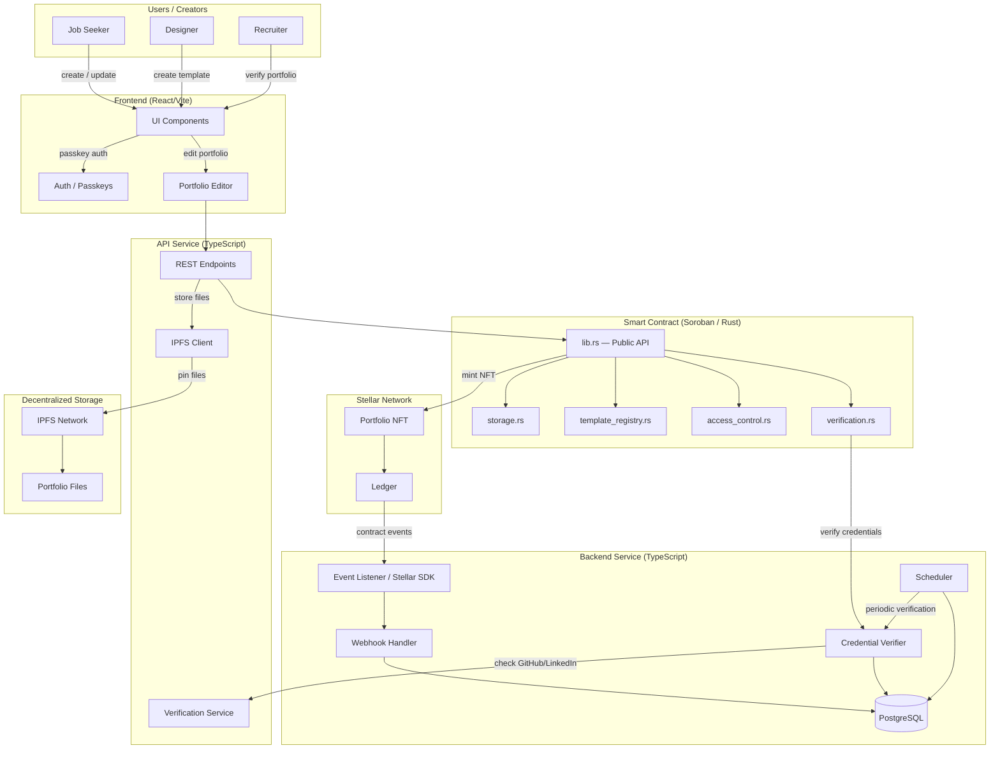
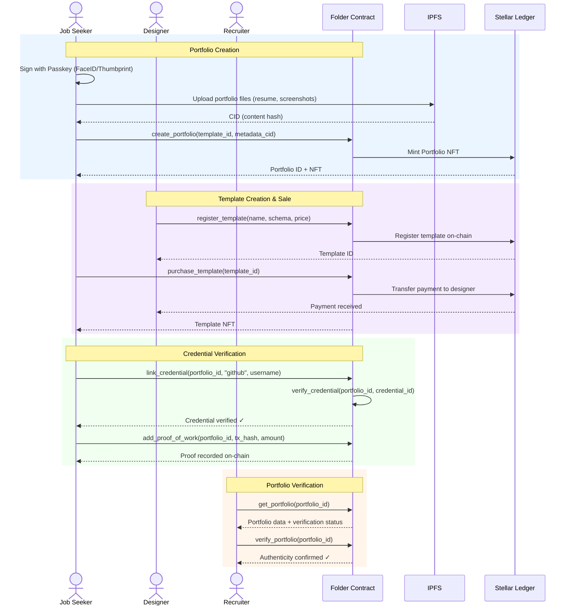

# 🏗️ Folder

[](https://github.com/yourusername/folder/actions/workflows/contract-ci.yml)

Dynamic on-chain identity and portfolio platform built on Stellar's Soroban smart contracts. Create, verify, and monetize your professional portfolio as a portable NFT.

## Overview

Folder transforms static portfolios into dynamic, verifiable on-chain identities. Users create a Stellar address, claim their portfolio namespace, and build a template-based portfolio backed by smart contracts and decentralized storage. Recruiters and clients can instantly verify authenticity. Designers can create and sell portfolio templates as digital assets.

## Features

- **Dynamic On-Chain Identity**: Stellar address-based portfolio ownership with cryptographic verification
- **Template Engine**: Pre-built Rust-based templates for different industries (Dev, Design, Admin, etc.)
- **Portfolio as NFT**: Portable, verifiable portfolios stored as NFTs with IPFS metadata
- **Credential Verification**: Link GitHub, LinkedIn, and on-chain credentials for proof of work
- **Passkey Onboarding**: Thumbprint/FaceID signup via Stellar Passkeys (SEP-20) — no recovery phrases
- **Template Marketplace**: Designers create and sell custom portfolio templates as digital assets
- **Proof of Work Integration**: Display payment history and on-chain transaction records as verified credentials
- **Decentralized Storage**: Portfolio files (resumes, screenshots) stored on IPFS with CID references on-chain

## Why Stellar

- **Minimal Costs**: Portfolio creation costs $0.00001 (fraction of a cent) vs. $20+ on other chains
- **Near-Instant Finality**: 5-second settlement — portfolio updates live globally immediately
- **Interoperability**: Integrate payment history (USDC, local fiat anchors) as proof of work
- **Accessibility**: Low barriers for job seekers in any economy

## Architecture



### Core Components

- **lib.rs**: Main contract implementation with portfolio and template functions
- **template_registry.rs**: Template storage, creation, and marketplace logic
- **access_control.rs**: Authorization and ownership verification
- **verification.rs**: Credential verification and proof validation
- **storage.rs**: Persistent storage for portfolios, templates, and credentials
- **types.rs**: Data structures (Portfolio, Template, Credential)
- **events.rs**: Event emission for portfolio updates and template sales

### Storage Model

- **Instance Storage**: Admin, template registry, marketplace configuration
- **Persistent Storage**: User portfolios, templates, credentials, verification records

## Contract Functions

### Portfolio Management

- `create_portfolio(user, template_id, metadata_cid)` - Create new portfolio (user auth required)
- `update_portfolio(portfolio_id, metadata_cid)` - Update portfolio metadata on IPFS (owner auth required)
- `get_portfolio(portfolio_id)` - Retrieve portfolio details and verification status
- `verify_portfolio(portfolio_id)` - Check portfolio authenticity and credential status

### Template Management

- `register_template(creator, name, schema, price)` - Create new template (creator auth required)
- `list_templates()` - Query available templates with pricing
- `purchase_template(template_id, buyer)` - Buy template as NFT (buyer auth required)
- `get_template(template_id)` - Retrieve template details and schema

### Credential Verification

- `link_credential(portfolio_id, credential_type, external_id)` - Link GitHub/LinkedIn/on-chain credential
- `verify_credential(portfolio_id, credential_id)` - Trigger verification of linked credential
- `get_credentials(portfolio_id)` - List all credentials for a portfolio
- `add_proof_of_work(portfolio_id, transaction_hash, amount)` - Add on-chain transaction as proof

### Administrative Functions

- `initialize(admin)` - One-time contract initialization
- `update_marketplace_fee(fee_bps)` - Set template marketplace fee (admin only)
- `withdraw_marketplace_fees(to)` - Collect marketplace revenue (admin only)

## Remittance Lifecycle — Sequence Diagram



## State Machine

Portfolio lifecycle with verification states:

```
┌──────────────┐
│   Created    │  ← initial state (portfolio minted)
└──────┬───────┘
       │
       ▼
┌──────────────────┐
│ Credentials      │  (credentials being verified)
│ Pending          │
└──────┬───────────┘
       │
       ├─────────────────────┐
       │                     │
       ▼                     ▼
┌──────────────┐      ┌──────────────┐
│ Verified     │      │ Unverified   │
│ (Terminal)   │      │ (Terminal)   │
└──────────────┘      └──────────────┘
```

## Error Codes

| Code | Error | Description |
|------|-------|-------------|
| 1 | AlreadyInitialized | Contract already initialized |
| 2 | NotInitialized | Contract not initialized |
| 3 | InvalidTemplateId | Template ID does not exist |
| 4 | InvalidPortfolioId | Portfolio ID does not exist |
| 5 | Unauthorized | Caller is not authorized for this operation |
| 6 | InvalidMetadataCid | Invalid IPFS content identifier |
| 7 | CredentialNotFound | Credential record not found |
| 8 | VerificationFailed | Credential verification failed |
| 9 | InvalidCredentialType | Unsupported credential type |
| 10 | TemplateAlreadyExists | Template already registered |
| 11 | InsufficientFunds | Insufficient balance for template purchase |
| 12 | InvalidPrice | Template price must be greater than 0 |
| 13 | PortfolioNotFound | Portfolio not found |
| 14 | CredentialAlreadyLinked | Credential already linked to portfolio |
| 15 | InvalidProofOfWork | Invalid transaction hash or amount |
| 16 | MarketplaceFeeInvalid | Marketplace fee out of valid range |
| 17 | NoFeesToWithdraw | No accumulated marketplace fees |
| 18 | InvalidAddress | Invalid Stellar address |

## Events

The contract emits events for monitoring:

- `portfolio_created` - New portfolio created
- `portfolio_updated` - Portfolio metadata updated
- `credential_linked` - Credential linked to portfolio
- `credential_verified` - Credential verification completed
- `template_registered` - New template created
- `template_purchased` - Template purchased as NFT
- `proof_of_work_added` - On-chain transaction recorded as proof
- `portfolio_verified` - Portfolio authenticity confirmed

## Roadmap

### Phase 1: The Identity
- [x] Stellar address-based portfolio ownership
- [x] Passkey onboarding (SEP-20)
- [ ] Portfolio namespace claiming

### Phase 2: Template Engine
- [ ] 3-5 basic Rust-based templates (Dev, Design, Admin, etc.)
- [ ] Template schema validation
- [ ] IPFS metadata storage

### Phase 3: Verification
- [ ] GitHub credential linking
- [ ] LinkedIn credential linking
- [ ] On-chain credential verification
- [ ] Proof of work integration (payment history)

### Phase 4: The Marketplace
- [ ] Designer template creation
- [ ] Template NFT minting
- [ ] Template sales and royalties
- [ ] Community template ratings

## Quick Start

### 1. Build the Contract

```bash
cd folder-contract
cargo build --target wasm32-unknown-unknown --release
soroban contract optimize --wasm target/wasm32-unknown-unknown/release/folder.wasm
```

### 2. Deploy to Testnet

```bash
soroban contract deploy \
  --wasm target/wasm32-unknown-unknown/release/folder.optimized.wasm \
  --source deployer \
  --network testnet
```

### 3. Initialize

```bash
soroban contract invoke \
  --id <CONTRACT_ID> \
  --source deployer \
  --network testnet \
  -- \
  initialize \
  --admin <ADMIN_ADDRESS>
```

### 4. Create Portfolio

```bash
soroban contract invoke \
  --id <CONTRACT_ID> \
  --source user \
  --network testnet \
  -- \
  create_portfolio \
  --template_id 1 \
  --metadata_cid "QmXxxx..."
```

## Configuration

Folder uses environment variables for configuration:

```bash
cp .env.example .env
```

Key variables:
- `NETWORK`: Network to connect to (`testnet` or `mainnet`)
- `FOLDER_CONTRACT_ID`: Deployed contract address
- `IPFS_API_URL`: IPFS node endpoint
- `MARKETPLACE_FEE_BPS`: Template marketplace fee (basis points)

## Testing

```bash
cargo test
```

Covers:
- ✅ Portfolio creation and updates
- ✅ Template registration and purchases
- ✅ Credential linking and verification
- ✅ Proof of work recording
- ✅ Authorization enforcement
- ✅ Event emission

## Security Features

1. **Passkey Authentication**: Biometric-based signing (no recovery phrases)
2. **Authorization Checks**: Role-based access control for all operations
3. **Ownership Verification**: Only portfolio owners can update their portfolio
4. **Credential Validation**: Multi-source verification (GitHub, LinkedIn, on-chain)
5. **IPFS Integrity**: Content-addressed storage ensures immutability

## Dependencies

- `soroban-sdk = "25.3.1"` - Latest Soroban SDK
- `ipfs-api` - IPFS client for file storage
- `stellar-sdk` - Stellar blockchain integration

## License

MIT

## Support

For issues and questions:
- GitHub Issues: [Create an issue](https://github.com/yourusername/folder/issues)
- Stellar Discord: https://discord.gg/stellar
- Documentation: See [DEPLOYMENT.md](DEPLOYMENT.md)

## Contributing

Contributions are welcome! Please see [CONTRIBUTING.md](CONTRIBUTING.md) for guidelines.

Quick checklist:
- All tests pass: `cargo test`
- Code follows project style guidelines
- New features include tests
- Documentation is updated
